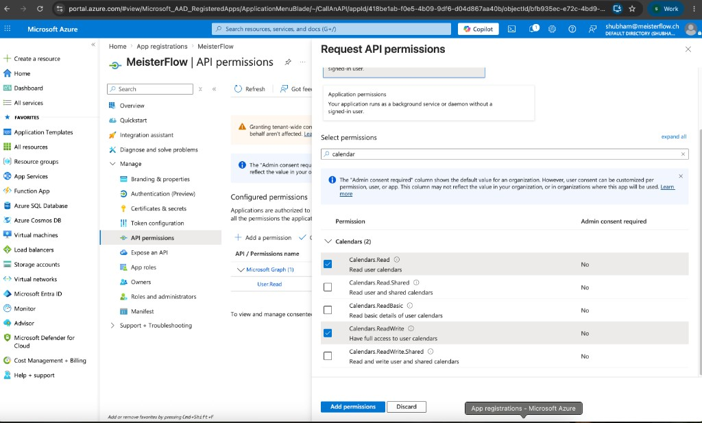

# Calendar integrations (Google & Outlook)

MeisterFlow connects each **business** to its own calendar via OAuth. Tokens are stored per business in `CalendarConnection` (encrypted at rest). The app supports 2-way appointment sync: MeisterFlow creates, updates, and deletes provider events, and inbound calendar changes are synced back into local bookings.

See also: [`PROJECT.md`](../PROJECT.md), [`.env.example`](../../.env.example), [`env/schema.mjs`](../../env/schema.mjs).

---

## Overview

| Provider | OAuth library | Auth endpoint | Callback |
| -------- | ------------- | ------------- | -------- |
| Google | `lib/google-calendar/oauth.ts` | `POST /api/google-calendar/auth` | `GET /api/google-calendar/callback` |
| Outlook | `lib/outlook-calendar/oauth.ts` | `POST /api/outlook-calendar/auth` | `GET /api/outlook-calendar/callback` |

Status (owner-only):

- `GET /api/google-calendar/status?businessId={uuid}`
- `GET /api/outlook-calendar/status?businessId={uuid}`

Redirect URIs are built from `NEXT_PUBLIC_URL`:

```
{NEXT_PUBLIC_URL}/api/google-calendar/callback
{NEXT_PUBLIC_URL}/api/outlook-calendar/callback
```

**Local development** (`NEXT_PUBLIC_URL=http://localhost:3000`):

```
http://localhost:3000/api/google-calendar/callback
http://localhost:3000/api/outlook-calendar/callback
```

**Production** — add the same paths on your live domain and set `NEXT_PUBLIC_URL` accordingly.

---

## Environment variables

Validated in `env/schema.mjs` at build time.

| Variable | Purpose |
| -------- | ------- |
| `NEXT_PUBLIC_URL` | App origin (no trailing slash). Used for OAuth redirect URIs. |
| `GOOGLE_CLIENT_ID` | Google OAuth client ID |
| `GOOGLE_CLIENT_SECRET` | Google OAuth client secret |
| `AZURE_CLIENT_ID` | Microsoft app (client) ID |
| `AZURE_CLIENT_SECRET` | Microsoft client secret |
| `ENCRYPTION_SECRET` | Encrypts access/refresh tokens in the database (16+ chars) |

---

## How it works in the app

1. Business user opens onboarding step 3 (**Connect calendar**) or settings (later).
2. They select **Google** or **Outlook** and click the connect button.
3. `POST /api/{google\|outlook}-calendar/auth` returns `{ authUrl }` (requires business owner session).
4. User completes OAuth with **their** Microsoft or Google account.
5. Callback exchanges the code, stores encrypted tokens on `CalendarConnection` for that `businessId`, and redirects back to onboarding.
6. Each business has at most one active calendar connection (`CalendarConnection.businessId` is unique).

**Multitenancy:** One OAuth app registration (Google + one Azure app) serves all MeisterFlow businesses. Each business owner authorizes with their own account; tokens are isolated by `businessId`.

---

## Google Calendar setup

### 1. Create a Google Cloud project

1. Open [Google Cloud Console](https://console.cloud.google.com/).
2. Create or select a project (e.g. `MeisterFlow`).

### 2. OAuth consent screen

1. **APIs & Services → OAuth consent screen**
2. User type: **External** (for customer Google accounts) or **Internal** (testing only, same Workspace org).
3. Fill app name, support email, developer contact.
4. Add scopes (or they are requested at runtime):
   - `https://www.googleapis.com/auth/calendar`
   - `https://www.googleapis.com/auth/calendar.events`
   - `https://www.googleapis.com/auth/gmail.send`
   - `https://www.googleapis.com/auth/userinfo.email`
   - `https://www.googleapis.com/auth/userinfo.profile`
5. Add test users while the app is in **Testing** mode.

### 3. OAuth client

1. **APIs & Services → Credentials → Create credentials → OAuth client ID**
2. Application type: **Web application**
3. **Authorized redirect URIs** — add both if you use local + production:

   ```
   http://localhost:3000/api/google-calendar/callback
   https://your-domain.com/api/google-calendar/callback
   ```

4. Copy **Client ID** → `GOOGLE_CLIENT_ID`
5. Copy **Client secret** → `GOOGLE_CLIENT_SECRET`

### 4. Enable Google APIs

**APIs & Services → Library** → enable:

- **Google Calendar API**
- **Gmail API** (required for sending invoices by email)

### 5. Reconnect after adding `gmail.send`

If a business connected Google **before** the Gmail send scope was added, disconnect and connect again in onboarding/settings so Google issues a new refresh token with email permission.

---

## Microsoft Outlook / 365 setup

### 1. Register the application

1. Open [Microsoft Entra admin center](https://entra.microsoft.com/) → **App registrations → New registration**
2. Name: `MeisterFlow`
3. Supported account types: **Any Entra ID Tenant + Personal Microsoft accounts**  
   (so any business can connect work M365 or personal Outlook)
4. Redirect URI — platform **Web**:

   ```
   http://localhost:3000/api/outlook-calendar/callback
   ```

   Add production URI after deploy.


### 2. Account type

Choose **Any Entra ID Tenant + Personal Microsoft accounts**:


| Option | When to use |
| ------ | ----------- |
| **Any Entra ID Tenant + Personal Microsoft accounts** | **Recommended** — each business connects their own work or personal account |
| Multiple Entra ID tenants | Work/school only, no personal Outlook |
| Single tenant | Your org only (internal testing) |
| Personal accounts only | Consumer Outlook only |

Our code uses the `/common/` Microsoft login endpoint, which requires a multitenant (+ personal) registration.

### 3. Client secret

1. **Certificates & secrets → New client secret**
2. Copy value → `AZURE_CLIENT_SECRET` (shown once)
3. **Overview → Application (client) ID** → `AZURE_CLIENT_ID`

### 4. API permissions

**API permissions → Add a permission → Microsoft Graph → Delegated permissions**

Minimum for listening to events:

| Permission | Purpose |
| ---------- | ------- |
| `User.Read` | Signed-in user profile / email |
| `Calendars.Read` | Read calendar events |
| `offline_access` | Refresh token |

The app currently also requests `Calendars.ReadWrite` and `OnlineMeetings.ReadWrite` in code (`lib/outlook-calendar/oauth.ts`). You can add `Calendars.ReadWrite` in Azure if you keep those scopes; tighten to read-only later when webhook/sync code is finalized.



Grant admin consent if your tenant requires it for organizational accounts.

---

## Onboarding UI (step 3)

Business users pick Google or Outlook, then a single **Connect** button for the selected provider:


Route: `/business/{businessId}/onboarding`

---

## Testing locally

1. Set `.env`:

   ```env
   NEXT_PUBLIC_URL=http://localhost:3000
   GOOGLE_CLIENT_ID=...
   GOOGLE_CLIENT_SECRET=...
   AZURE_CLIENT_ID=...
   AZURE_CLIENT_SECRET=...
   ENCRYPTION_SECRET=...
   ```

2. Register redirect URIs with `http://localhost:3000/...` on both Google and Azure.
3. Start app: `npm run dev`
4. Sign in as a business user → onboarding step 3 → connect calendar.
5. After success you should land back on onboarding with a connected state; tokens appear on `calendar_connections`.

---

## Troubleshooting

| Issue | Check |
| ----- | ----- |
| `redirect_uri_mismatch` | `NEXT_PUBLIC_URL` must match the URI registered in Google/Azure exactly (no trailing slash on base URL). |
| Google "access blocked" / unverified app | Add user as test user on consent screen, or complete verification for production. |
| Outlook "AADSTS50011" redirect mismatch | Same as above; Web platform URI must match callback path. |
| Outlook single-tenant app + `/common/` login | Re-register as multitenant or change authority in code to your tenant ID. |
| Env validation fails on build | All vars in `env/schema.mjs` must be set; see `.env.example`. |

---

## Code reference

```
lib/
  google-calendar/oauth.ts    # Google OAuth + token storage
  outlook-calendar/oauth.ts   # Outlook OAuth + token storage
  encryption.ts               # AES encrypt/decrypt for tokens
app/api/
  google-calendar/auth|callback|status/
  outlook-calendar/auth|callback|status/
prisma/schema.prisma          # CalendarConnection model
```
